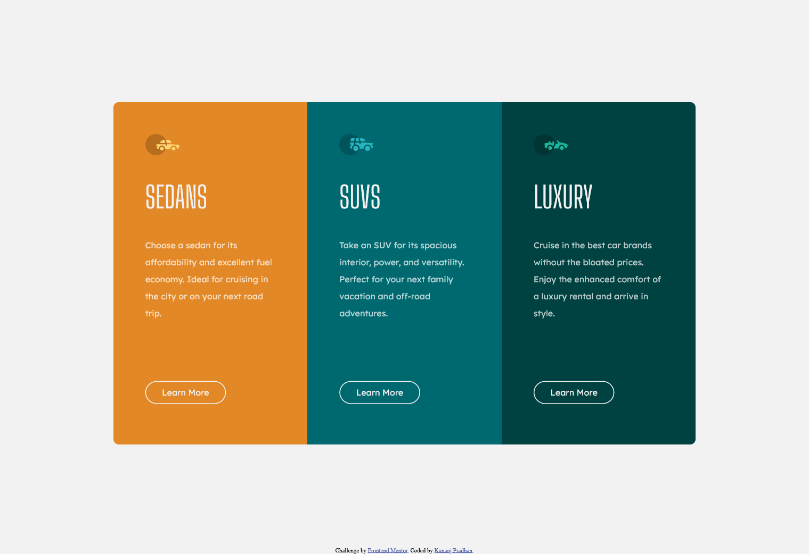
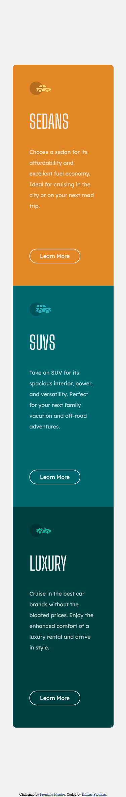

# Frontend Mentor - 3-column preview card component solution

This is a solution to the [3-column preview card component challenge on Frontend Mentor](https://www.frontendmentor.io/challenges/3column-preview-card-component-pH92eAR2-). Frontend Mentor challenges help you improve your coding skills by building realistic projects. 

## Table of contents

- [Overview](#overview)
  - [The challenge](#the-challenge)
  - [Screenshot](#screenshot)
  - [Links](#links)
- [My process](#my-process)
  - [Built with](#built-with)
  - [What I learned](#what-i-learned)
  - [Continued development](#continued-development)
  - [Useful resources](#useful-resources)
- [Author](#author)
- [Acknowledgments](#acknowledgments)

**Note: Delete this note and update the table of contents based on what sections you keep.**

## Overview

### The challenge

Users should be able to:

- View the optimal layout depending on their device's screen size
- See hover states for interactive elements

### Screenshot

### Links

- Solution URL: [Add solution URL here](https://your-solution-url.com)
- Live Site URL: [Add live site URL here](https://your-live-site-url.com)

## My process
firstly I created a parent-container, and then inside that container, I create 3 child-containers and put the respective images, headings, paragraphs and buttons. Then I gave them class names and styled them in css with respective colors and font styles. Then, here comes the main and best part of the design&coding. I gave the display:flex and flex-direction row and flex-wrap: wrap; to the parent-container. And to make it mobile responsive I changed the flex-direction:column and decresed some padding and that's all.
### Built with

- Semantic HTML5 markup
- CSS custom properties
- Flexbox

### Useful resources

- [W3school](https://www.w3schools.com) - This helped me with flex properties. I really liked this pattern and will use it going forward.

## Author

- Website - [Add your name here](https://www.your-site.com)
- Frontend Mentor - [@Kunanj](https://www.frontendmentor.io/profile/Kunanj)
- LinkedIn - [Kunanj Pradhan](https://www.linkedin.com/in/kunanj-pradhan-28b2001b2/)
- Twitter - [@Kunanjp](https://twitter.com/Kunanjp)
